<div align="center">

# FLIPPA MCP

**Search, analyze, and evaluate online businesses on Flippa — powered by AI.**

**No API key required. No account needed. Just plug into Claude and go.**

[](https://www.npmjs.com/package/flippa-mcp-server)
[](https://www.npmjs.com/package/flippa-mcp-server)
[](https://github.com/sind00/flippa-mcp)
[](LICENSE)

<br>

```bash
npx flippa-mcp-server
```

**Works on Mac, Windows, and Linux.**

<br>



<br>

[Why Flippa MCP](#why-flippa-mcp) · [Tools](#tools) · [Getting Started](#getting-started) · [Examples](#examples)

</div>

---

## Why Flippa MCP

[Flippa](https://flippa.com) is the world's largest marketplace for buying and selling online businesses — websites, SaaS products, ecommerce stores, apps, newsletters, and more. Thousands of listings, each with revenue claims, traffic stats, and asking prices that may or may not make sense.

Evaluating a listing manually means checking revenue multiples, comparing prices across similar businesses, assessing risk factors, and doing math you'll probably get wrong at 2am. Multiply that by the dozens of listings you need to review to find a good deal.

**Flippa MCP gives Claude full marketplace intelligence.** Five specialized tools that search listings, pull detailed financials, compute valuation metrics, find comparable sales, and generate market overviews. Zero configuration. No API key. No Flippa account. Just install and ask Claude to find you a good deal.

---

## Who This Is For

- **Entrepreneurs** evaluating businesses to buy on Flippa
- **Investors** doing due diligence on online business acquisitions
- **Sellers** researching pricing and market conditions before listing
- **Anyone** who wants AI-powered marketplace intelligence without the spreadsheet grind

---

## Getting Started

### Install

```bash
npx flippa-mcp-server
```

Or install globally:

```bash
npm install -g flippa-mcp-server
```

### Claude Desktop Configuration

Add to your Claude Desktop config file:

```json
{
  "mcpServers": {
    "flippa": {
      "command": "npx",
      "args": ["flippa-mcp-server"]
    }
  }
}
```

<details>
<summary><strong>Config file locations</strong></summary>

| Platform | Path |
|----------|------|
| macOS | `~/Library/Application Support/Claude/claude_desktop_config.json` |
| Windows | `%APPDATA%\Claude\claude_desktop_config.json` |
| Linux | `~/.config/claude/claude_desktop_config.json` |

</details>

> [!TIP]
> **No API key required!** The Flippa listings API is public. All 5 tools work without any authentication or Flippa account.

---

## Tools

| Tool | Description |
|------|-------------|
| `flippa_search_listings` | Search and browse listings with filters for type, status, sale method, and sorting |
| `flippa_get_listing` | Get complete details for any listing by ID |
| `flippa_analyze_listing` | Compute valuation metrics: revenue multiples, ROI, risk factors, and buy/pass verdict |
| `flippa_comparable_sales` | Find comparable listings and get aggregate pricing stats |
| `flippa_market_overview` | Get market-wide statistics across property types |

<details>
<summary><strong>flippa_search_listings</strong> — Search the marketplace</summary>

| Parameter | Type | Required | Default | Description |
|-----------|------|----------|---------|-------------|
| `property_type` | string | No | — | `website`, `saas`, `ecommerce_store`, `fba`, `ios_app`, `android_app`, `ai_apps_and_tools`, `youtube`, `newsletter`, `service`, `other` |
| `status` | string | No | `open` | `open`, `closed`, `ended` |
| `sale_method` | string | No | — | `auction`, `classified` |
| `sort_alias` | string | No | — | `lowest_price`, `highest_price`, `most_active`, `most_recent`, `ending_soonest`, `most_profitable`, `most_relevant` |
| `page_number` | number | No | `1` | Page number for pagination |
| `page_size` | number | No | `30` | Results per page (1–100) |
| `response_format` | string | No | `markdown` | `markdown` or `json` |

</details>

<details>
<summary><strong>flippa_get_listing</strong> — Get listing details</summary>

| Parameter | Type | Required | Default | Description |
|-----------|------|----------|---------|-------------|
| `listing_id` | string | **Yes** | — | The Flippa listing ID (e.g., `"12299903"`) |
| `response_format` | string | No | `markdown` | `markdown` or `json` |

Returns complete listing data: pricing, revenue, profit, traffic, seller info, verification status, description, images, and more.

</details>

<details>
<summary><strong>flippa_analyze_listing</strong> — Valuation analysis</summary>

| Parameter | Type | Required | Default | Description |
|-----------|------|----------|---------|-------------|
| `listing_id` | string | **Yes** | — | The Flippa listing ID to analyze |
| `response_format` | string | No | `markdown` | `markdown` or `json` |

Returns computed metrics:
- Revenue multiple, profit multiple, annual revenue
- Price per visitor, revenue per visitor
- Estimated ROI in months
- Verdict: **underpriced**, **fair**, **overpriced**, or **insufficient_data**
- Risk factors (unverified revenue, low traffic, no bids, etc.)

</details>

<details>
<summary><strong>flippa_comparable_sales</strong> — Find comparables</summary>

| Parameter | Type | Required | Default | Description |
|-----------|------|----------|---------|-------------|
| `listing_id` | string | No | — | Find comparables for this listing (uses its type and revenue range) |
| `property_type` | string | No | — | Filter by type. Overrides listing's type if both provided. |
| `page_size` | number | No | `10` | Number of comparables (1–20) |
| `response_format` | string | No | `markdown` | `markdown` or `json` |

Returns comparable listings with aggregate stats: average price, median price, average revenue multiple, and price range.

</details>

<details>
<summary><strong>flippa_market_overview</strong> — Market snapshot</summary>

| Parameter | Type | Required | Default | Description |
|-----------|------|----------|---------|-------------|
| `property_type` | string | No | — | Focus on one type, or omit for full market view |
| `response_format` | string | No | `markdown` | `markdown` or `json` |

Returns market-wide stats: total listings, breakdown by type, price/revenue/profit statistics (min, max, avg, median), average revenue multiple, and verified revenue percentage.

</details>

---

## Examples

### Search for profitable SaaS businesses

> *"Find me SaaS listings on Flippa sorted by most profitable"*

Uses `flippa_search_listings` with `property_type: "saas"` and `sort_alias: "most_profitable"`.

### Analyze a specific listing

> *"Analyze Flippa listing 12299903 — is it fairly priced?"*

Uses `flippa_analyze_listing` to compute revenue multiples, ROI, and risk factors, then delivers a verdict.

### Compare with the market

> *"Find comparable listings for this SaaS business and tell me if the asking price is reasonable"*

Uses `flippa_comparable_sales` to find similar listings by type and revenue range, then compares pricing.

### Get a market snapshot

> *"Give me an overview of the current Flippa marketplace for ecommerce stores"*

Uses `flippa_market_overview` to aggregate stats across all ecommerce listings.

### Deep dive evaluation

> *"Search for the top 5 most profitable websites on Flippa, then analyze each one and tell me which is the best deal"*

Chains `flippa_search_listings` → `flippa_analyze_listing` across multiple listings to find the best opportunity.

---

## How Analysis Works

The `flippa_analyze_listing` tool fetches a listing and computes valuation metrics:

| Metric | Formula |
|--------|---------|
| **Revenue Multiple** | Asking Price / Annual Revenue |
| **Profit Multiple** | Asking Price / Annual Profit |
| **ROI Estimate** | Asking Price / Monthly Profit (payback in months) |
| **Price per Visitor** | Asking Price / Monthly Uniques |

### Verdict Logic

| Revenue Multiple | Verdict |
|-----------------|---------|
| < 2x | **Underpriced** — below typical range, investigate why |
| 2x – 4x | **Fair** — within standard online business valuation range |
| > 4x | **Overpriced** — above typical range, ensure premium is justified |
| No revenue data | **Insufficient Data** — cannot determine valuation |

### Risk Factors Detected

The tool automatically flags these concerns:

- No reported revenue or profit
- Traffic data unavailable or very low (< 1,000 uniques/mo)
- Revenue not verified by Flippa
- Traffic not verified by Flippa
- Seller is not a Super Seller
- No bids on the listing
- No images provided
- Very short listing description (< 100 chars)
- Confidential listing with limited data

---

## Configuration

| Variable | Required | Default | Description |
|----------|----------|---------|-------------|
| `FLIPPA_BASE_URL` | No | `https://flippa.com/v3` | Override the Flippa API base URL |
| `FLIPPA_API_TOKEN` | No | — | Bearer token for future authenticated endpoints (watchlist, bidding) |

### With environment variables

```json
{
  "mcpServers": {
    "flippa": {
      "command": "npx",
      "args": ["flippa-mcp-server"],
      "env": {
        "FLIPPA_API_TOKEN": "your-token-here"
      }
    }
  }
}
```

---

## Supported Property Types

| Type | Description |
|------|-------------|
| `website` | Content sites, blogs, media properties |
| `saas` | Software as a Service businesses |
| `ecommerce_store` | Online stores and shops |
| `fba` | Amazon FBA businesses |
| `ios_app` | iOS applications |
| `android_app` | Android applications |
| `ai_apps_and_tools` | AI-powered applications and tools |
| `youtube` | YouTube channels |
| `newsletter` | Email newsletters |
| `service` | Service businesses and agencies |
| `other` | Other business types |

---

## Development

```bash
git clone https://github.com/sind00/flippa-mcp.git
cd flippa-mcp
npm install
npm run dev    # Watch mode with tsx
npm run build  # Compile TypeScript
npm start      # Run compiled server
```

### Project Structure

```
src/
  index.ts              # Server entry point
  types.ts              # TypeScript interfaces
  constants.ts          # Configuration constants
  schemas/
    listing.ts          # Zod validation schemas
  services/
    flippa-client.ts    # HTTP client (retry, rate limiting)
    formatter.ts        # Response formatting (markdown/json)
  tools/
    search.ts           # flippa_search_listings
    details.ts          # flippa_get_listing
    analyze.ts          # flippa_analyze_listing
    compare.ts          # flippa_comparable_sales
    market.ts           # flippa_market_overview
```

---

## License

MIT License. See [LICENSE](LICENSE) for details.

---

<div align="center">

**Flippa has the listings. Claude has the brains. This connects them.**

</div>
